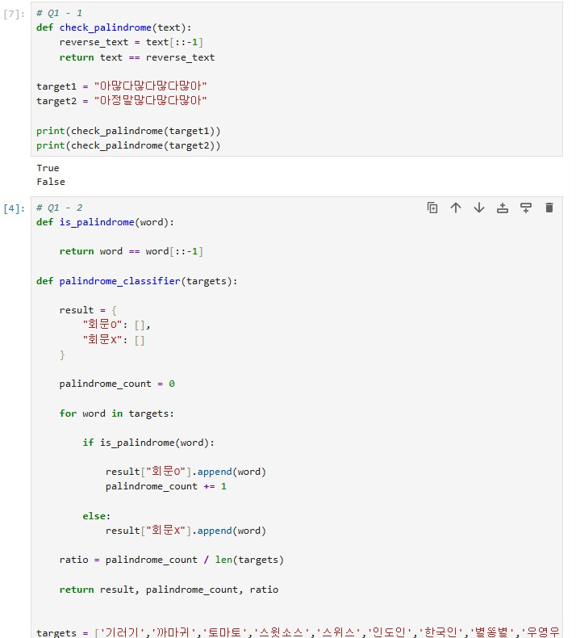
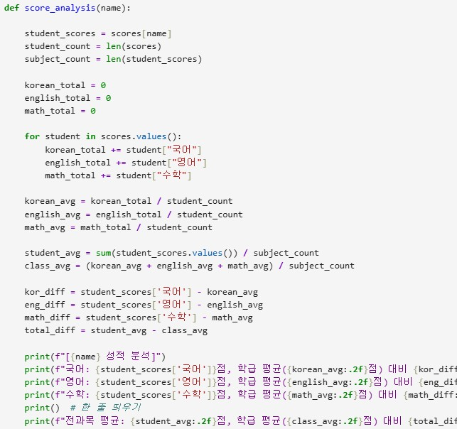

# AIFFEL Campus Online Code Peer Review Templete
- 코더 : 김민
- 리뷰어 : 박애희


# PRT(Peer Review Template)
- [ ]  **1. 주어진 문제를 해결하는 완성된 코드가 제출되었나요?**
    - 문제에서 요구하는 최종 결과물이 첨부되었는지 확인
        - 중요! 해당 조건을 만족하는 부분을 캡쳐해 근거로 첨부

  
: 주어진 문제가 모두 해결 되었고 출력도 확인되었다.
    
- [ ]  **2. 전체 코드에서 가장 핵심적이거나 가장 복잡하고 이해하기 어려운 부분에 작성된 
주석 또는 doc string을 보고 해당 코드가 잘 이해되었나요?**
    - 해당 코드 블럭을 왜 핵심적이라고 생각하는지 확인
    - 해당 코드 블럭에 doc string/annotation이 달려 있는지 확인
    - 해당 코드의 기능, 존재 이유, 작동 원리 등을 기술했는지 확인
    - 주석을 보고 코드 이해가 잘 되었는지 확인
        - 중요! 잘 작성되었다고 생각되는 부분을 캡쳐해 근거로 첨부
     
    : 주석이 거의 작성되지 않았다.(나도 작성하지 않았음)
        
- [ ]  **3. 에러가 난 부분을 디버깅하여 문제를 해결한 기록을 남겼거나
새로운 시도 또는 추가 실험을 수행해봤나요?**
    - 문제 원인 및 해결 과정을 잘 기록하였는지 확인
    - 프로젝트 평가 기준에 더해 추가적으로 수행한 나만의 시도, 
    실험이 기록되어 있는지 확인
        - 중요! 잘 작성되었다고 생각되는 부분을 캡쳐해 근거로 첨부
     
    : 남기지 않았다. (나도 남기지 않았음....)
        
- [ ]  **4. 회고를 잘 작성했나요?**
    - 주어진 문제를 해결하는 완성된 코드 내지 프로젝트 결과물에 대해
    배운점과 아쉬운점, 느낀점 등이 기록되어 있는지 확인
    - 전체 코드 실행 플로우를 그래프로 그려서 이해를 돕고 있는지 확인
        - 중요! 잘 작성되었다고 생각되는 부분을 캡쳐해 근거로 첨부
    
    : 회고가 작성되지 않았다. (나도 몰랐음)
         
- [ ]  **5. 코드가 간결하고 효율적인가요?**
    - 파이썬 스타일 가이드 (PEP8) 를 준수하였는지 확인
    - 코드 중복을 최소화하고 범용적으로 사용할 수 있도록 함수화/모듈화했는지 확인
        - 중요! 잘 작성되었다고 생각되는 부분을 캡쳐해 근거로 첨부
     
      
    : 필요한 모든 기능이 들어간 함수를 활용하여 원하는 정보를 불러올 수 있도록 잘 정리되었다.

 
# 회고(참고 링크 및 코드 개선)
```
# 리뷰어의 회고를 작성합니다.
# 코드 리뷰 시 참고한 링크가 있다면 링크와 간략한 설명을 첨부합니다.
# 코드 리뷰를 통해 개선한 코드가 있다면 코드와 간략한 설명을 첨부합니다.
```
C2 문제에서 저의 경우 예시 이미지가 행열로 되어있어서 표로 진행했습니다.  
저와 달리 딕셔너리로 하셨고, 기능 구현 목표는 같기 때문에 틀은 비슷하면서도  
흐름이나 방법이 조금씩 달라서 보는데 흥미로웠고  
다른 관점에서 활용할 수 있는 예제를 볼 수 있어서 공부가 됐습니다. 
이 md 파일 작성하다 보니 할 게 많아보이는데 저도 하나도 안 했고,
정답도 몰라서 제가 뭐라 드릴 말씀이 없는 것 같아요.
앞으로도 화이팅입니다!